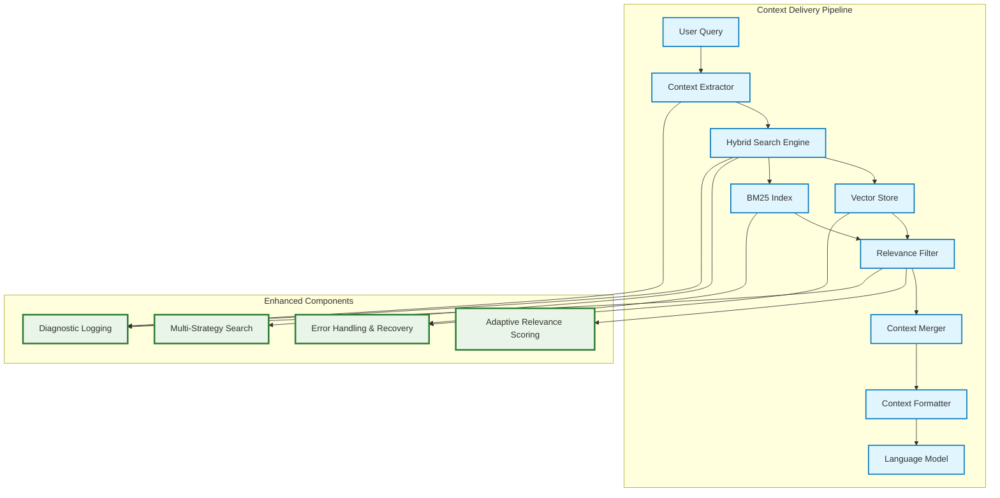

# Context Delivery Fix Design

## Overview

This design addresses the critical issue where CodeWise's context delivery system works for the first query but fails for subsequent queries. The solution involves fixing relevance scoring, improving search strategies, enhancing error handling, and adding comprehensive diagnostics.

## Architecture

The fix involves modifications to several key components in the context delivery pipeline:



## Components and Interfaces

### 1. Enhanced Context Extractor

**Purpose:** Improve key term extraction and query analysis for better context discovery.

**Key Changes:**
- Better project name detection from query context
- Improved technical term extraction patterns
- Context-aware term weighting based on previous successful queries
- Fallback term extraction when primary methods fail

**Interface:**
```python
class EnhancedContextExtractor:
    def extract_key_terms(self, query: str, context_history: List[str] = None) -> List[str]
    def analyze_query_intent(self, query: str) -> QueryIntent
    def get_project_hints(self, query: str) -> List[str]
```

### 2. Adaptive Relevance Scoring

**Purpose:** Implement dynamic relevance thresholds that adapt based on available results.

**Key Features:**
- Multi-tier relevance thresholds (strict → moderate → lenient)
- Project-specific score boosting
- Query complexity-based threshold adjustment
- Automatic threshold lowering when no results found

**Interface:**
```python
class AdaptiveRelevanceScorer:
    def calculate_relevance_score(self, result: SearchResult, query: str, context: Dict) -> float
    def get_adaptive_threshold(self, query: str, initial_results_count: int) -> float
    def boost_project_results(self, results: List[SearchResult], project_hints: List[str]) -> List[SearchResult]
```

### 3. Multi-Strategy Search Engine

**Purpose:** Implement fallback search strategies when primary methods fail.

**Search Strategies:**
1. **Primary:** Hybrid search (vector + BM25)
2. **Secondary:** Vector-only search with lowered threshold
3. **Tertiary:** BM25-only search with expanded terms
4. **Fallback:** Directory-based project search
5. **Emergency:** File listing with pattern matching

**Interface:**
```python
class MultiStrategySearchEngine:
    def search_with_fallbacks(self, query: str, max_attempts: int = 5) -> SearchResults
    def try_strategy(self, strategy: SearchStrategy, query: str) -> Optional[SearchResults]
    def get_next_strategy(self, current_strategy: SearchStrategy, results: SearchResults) -> Optional[SearchStrategy]
```

### 4. Enhanced Error Handling and Recovery

**Purpose:** Graceful error handling with automatic recovery mechanisms.

**Recovery Mechanisms:**
- Index validation and rebuilding
- Search component reinitialization
- Graceful degradation to simpler search methods
- State consistency checks

**Interface:**
```python
class ErrorRecoveryManager:
    def handle_search_failure(self, error: Exception, context: Dict) -> RecoveryAction
    def validate_search_components(self) -> ComponentStatus
    def reinitialize_failed_components(self, failed_components: List[str]) -> bool
```

### 5. Comprehensive Diagnostic System

**Purpose:** Detailed logging and monitoring of the context delivery pipeline.

**Diagnostic Features:**
- Query-level performance tracking
- Search strategy effectiveness monitoring
- Relevance score distribution analysis
- Context delivery success/failure rates

**Interface:**
```python
class ContextDeliveryDiagnostics:
    def log_query_start(self, query: str, query_id: str) -> None
    def log_search_attempt(self, strategy: str, results_count: int, threshold: float) -> None
    def log_relevance_filtering(self, before_count: int, after_count: int, threshold: float) -> None
    def log_context_delivery_result(self, success: bool, chunks_delivered: int, total_tokens: int) -> None
```

## Data Models

### QueryIntent
```python
@dataclass
class QueryIntent:
    project_names: List[str]
    file_patterns: List[str]
    technical_terms: List[str]
    query_type: str  # 'code_analysis', 'file_search', 'general'
    complexity_score: float
```

### SearchStrategy
```python
@dataclass
class SearchStrategy:
    name: str
    search_function: Callable
    relevance_threshold: float
    max_results: int
    boost_factors: Dict[str, float]
```

### ComponentStatus
```python
@dataclass
class ComponentStatus:
    vector_store_healthy: bool
    bm25_index_healthy: bool
    hybrid_search_healthy: bool
    last_check_time: datetime
    error_messages: List[str]
```

## Error Handling

### Error Categories and Recovery Actions

1. **Vector Store Errors**
   - Index corruption → Rebuild index
   - Embedding API failure → Use BM25-only search
   - Memory issues → Reduce batch size and retry

2. **BM25 Index Errors**
   - Index missing → Rebuild from documents
   - Search failure → Fall back to vector search
   - Tokenization errors → Use simple text matching

3. **Hybrid Search Errors**
   - Component initialization failure → Initialize components individually
   - Result fusion errors → Use best available results from working components
   - Timeout errors → Reduce search scope and retry

4. **Context Delivery Errors**
   - No results found → Try progressively more lenient strategies
   - Token limit exceeded → Implement intelligent truncation
   - Formatting errors → Use simplified context format

## Testing Strategy

### Unit Tests
- Test each component's error handling independently
- Verify relevance scoring algorithms with known datasets
- Test search strategy fallback mechanisms
- Validate diagnostic logging accuracy

### Integration Tests
- Test complete context delivery pipeline with various query types
- Verify cross-component error recovery
- Test performance under different load conditions
- Validate context consistency across multiple queries

### End-to-End Tests
- Test real-world query scenarios that previously failed
- Verify fix effectiveness with imported repository queries
- Test context delivery consistency over extended conversations
- Validate diagnostic information accuracy

### Performance Tests
- Measure context delivery latency improvements
- Test memory usage under various search strategies
- Verify search result quality metrics
- Monitor system resource utilization

## Implementation Phases

### Phase 1: Core Fixes
- Implement adaptive relevance scoring
- Fix vector store query method issues
- Add basic error recovery mechanisms
- Enhance context extractor

### Phase 2: Advanced Features
- Implement multi-strategy search engine
- Add comprehensive diagnostic system
- Implement state management improvements
- Add performance monitoring

### Phase 3: Optimization
- Fine-tune relevance scoring algorithms
- Optimize search strategy selection
- Implement advanced error recovery
- Add predictive context caching

## Monitoring and Metrics

### Key Performance Indicators
- Context delivery success rate (target: >95%)
- Average query response time (target: <2 seconds)
- Context relevance score (target: >0.7 average)
- Error recovery success rate (target: >90%)

### Diagnostic Metrics
- Search strategy usage distribution
- Relevance threshold effectiveness
- Component health status
- Query complexity vs. success rate correlation

## Security Considerations

- Ensure error messages don't leak sensitive information
- Validate all user inputs in search queries
- Implement rate limiting for search operations
- Secure diagnostic log storage and access