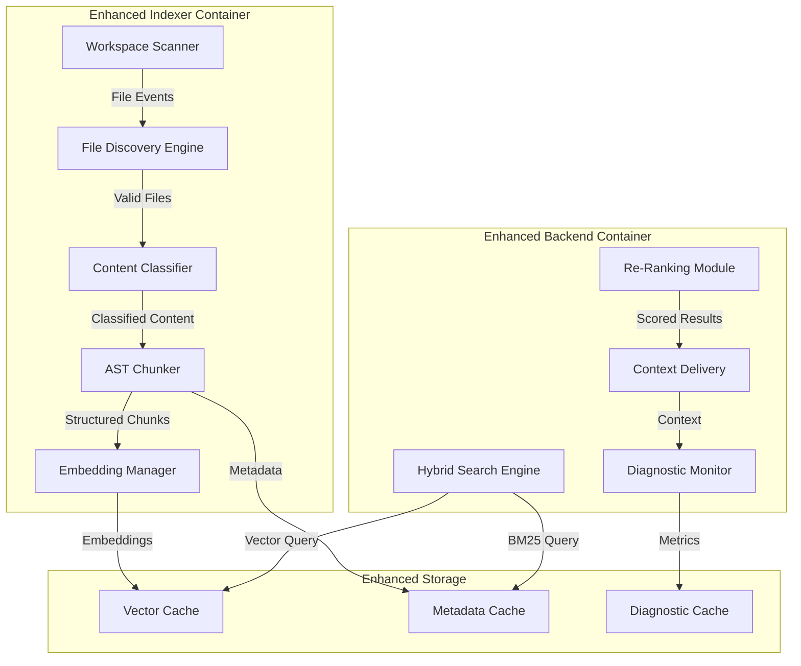

# Design Document

## Overview

This design enhances the existing CodeWise architecture by improving the ingestion and context delivery pipeline while maintaining the current 4-container structure (Frontend, Backend, MCP Server, Indexer). The solution focuses on upgrading the Indexer service with comprehensive file discovery, implementing AST-based chunking, adding hybrid search capabilities to the Backend, and introducing robust diagnostic systems. All changes preserve the existing FastAPI/LangChain agent architecture and FAISS vector store foundation.

## Architecture

### Current Architecture Preservation
The design maintains the existing containerized architecture:
- **Frontend**: Enhanced with API provider toggle (OpenAI/Kimi K2)
- **Backend**: Enhanced with hybrid search, improved context delivery, and multi-provider API support
- **MCP Server**: No changes required  
- **Indexer**: Major enhancements for file discovery and chunking
- **Storage**: Enhanced vector cache structure with metadata

### Enhanced Component Interactions



## Components and Interfaces

### 1. Enhanced File Discovery Engine

**Purpose**: Comprehensive file detection and classification
**Location**: `indexer/file_discovery.py`

```python
class FileDiscoveryEngine:
    def __init__(self, workspace_path: Path):
        self.workspace_path = workspace_path
        self.valid_extensions = {
            ".py", ".js", ".ts", ".tsx", ".jsx", ".md", ".txt", 
            ".json", ".html", ".css", ".yaml", ".yml", ".toml", 
            ".lock", ".env", ".config"
        }
        self.stats = FileDiscoveryStats()
    
    def discover_files(self) -> List[FileInfo]:
        """Discover all indexable files with comprehensive filtering"""
        
    def should_index_file(self, path: Path) -> bool:
        """Determine if file should be indexed based on multiple criteria"""
        
    def detect_text_file(self, path: Path) -> bool:
        """Detect text files without extensions using content analysis"""
        
    def get_discovery_stats(self) -> FileDiscoveryStats:
        """Return comprehensive discovery statistics"""
```

**Key Features**:
- Extension-based filtering with comprehensive file type support
- Content-based text file detection for extensionless files
- Safe symlink following with circular reference detection
- Binary file detection and exclusion
- Comprehensive logging and statistics

### 2. AST-Based Chunking System

**Purpose**: Intelligent code structure preservation
**Location**: `indexer/ast_chunker.py`

```python
class ASTChunker:
    def __init__(self):
        self.chunkers = {
            'python': PythonASTChunker(),
            'javascript': JavaScriptASTChunker(),
            'typescript': TypeScriptASTChunker(),
            'markdown': MarkdownChunker(),
            'config': ConfigChunker()
        }
    
    def chunk_content(self, content: str, file_path: Path) -> List[CodeChunk]:
        """Chunk content based on file type and structure"""
        
    def get_file_type(self, file_path: Path) -> str:
        """Determine appropriate chunking strategy"""

class CodeChunk:
    text: str
    metadata: ChunkMetadata
    file_path: str
    start_line: int
    end_line: int
```

**Chunking Strategies**:
- **Python/JS/TS**: AST-based function and class boundaries
- **Config Files**: Single chunk with section metadata
- **Markdown**: Headline-based sections with overlap
- **Small Files**: Single chunk preservation
- **Fallback**: Character-based chunking for syntax errors

### 3. Hybrid Search Engine

**Purpose**: Combined semantic and keyword search
**Location**: `backend/hybrid_search.py`

```python
class HybridSearchEngine:
    def __init__(self, vector_store: VectorStore):
        self.vector_store = vector_store
        self.bm25_index = BM25Index()
        self.reranker = CrossEncoderReranker()
        
    def search(self, query: str, k: int = 5) -> List[SearchResult]:
        """Execute hybrid search with re-ranking"""
        
    def vector_search(self, query: str, k: int) -> List[VectorResult]:
        """Semantic similarity search"""
        
    def bm25_search(self, query: str, k: int) -> List[BM25Result]:
        """Keyword-based search"""
        
    def rerank_results(self, query: str, results: List[SearchResult]) -> List[SearchResult]:
        """Re-rank combined results using cross-encoder"""
```

**Search Pipeline**:
1. Execute vector similarity search (semantic)
2. Execute BM25 keyword search (exact matches)
3. Combine and deduplicate results
4. Apply cross-encoder re-ranking
5. Filter by relevance threshold
6. Return top-k results with scores

### 4. Enhanced Context Delivery System

**Purpose**: Optimized context preparation for LLM
**Location**: `backend/context_delivery.py`

```python
class ContextDeliverySystem:
    def __init__(self, hybrid_search: HybridSearchEngine):
        self.hybrid_search = hybrid_search
        self.token_counter = TokenCounter()
        self.context_optimizer = ContextOptimizer()
        
    def prepare_context(self, query: str, max_tokens: int = 4000) -> ContextPackage:
        """Prepare optimized context for LLM consumption"""
        
    def merge_adjacent_chunks(self, chunks: List[CodeChunk]) -> List[CodeChunk]:
        """Merge adjacent chunks from same file when beneficial"""
        
    def format_context(self, chunks: List[CodeChunk]) -> str:
        """Format context with proper attribution and structure"""
```

**Context Optimization**:
- Token-aware chunk selection
- Adjacent chunk merging
- Relevance-based prioritization
- Proper file path attribution
- Syntax highlighting markers

### 5. Multi-Provider API System

**Purpose**: Support for multiple AI API providers with seamless switching
**Location**: `backend/api_providers.py`

```python
class APIProviderManager:
    def __init__(self):
        self.providers = {
            'openai': OpenAIProvider(),
            'kimi': KimiProvider()
        }
        self.current_provider = 'openai'
        
    def switch_provider(self, provider_name: str):
        """Switch active API provider"""
        
    def get_current_provider(self) -> BaseProvider:
        """Get currently active provider instance"""
        
    def generate_embeddings(self, texts: List[str]) -> List[List[float]]:
        """Generate embeddings using current provider"""
        
    def chat_completion(self, messages: List[Dict], **kwargs) -> str:
        """Generate chat completion using current provider"""

class KimiProvider(BaseProvider):
    def __init__(self):
        self.api_key = "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"
        self.base_url = "https://api.moonshot.cn/v1"
        
    def generate_embeddings(self, texts: List[str]) -> List[List[float]]:
        """Generate embeddings using Kimi API"""
        
    def chat_completion(self, messages: List[Dict], **kwargs) -> str:
        """Generate chat completion using Kimi API"""
```

### 6. Frontend API Toggle Component

**Purpose**: User interface for switching between API providers
**Location**: `frontend/components/APIProviderToggle.tsx`

```typescript
interface APIProviderToggleProps {
  currentProvider: 'openai' | 'kimi';
  onProviderChange: (provider: 'openai' | 'kimi') => void;
}

export function APIProviderToggle({ currentProvider, onProviderChange }: APIProviderToggleProps) {
  return (
    <div className="flex items-center space-x-2">
      <label className="text-sm font-medium">API Provider:</label>
      <select 
        value={currentProvider} 
        onChange={(e) => onProviderChange(e.target.value as 'openai' | 'kimi')}
        className="border rounded px-2 py-1"
      >
        <option value="openai">OpenAI</option>
        <option value="kimi">Kimi K2</option>
      </select>
    </div>
  );
}
```

### 7. Diagnostic and Monitoring System

**Purpose**: Comprehensive system health monitoring
**Location**: `backend/diagnostics.py`

```python
class DiagnosticSystem:
    def __init__(self):
        self.metrics_collector = MetricsCollector()
        self.alert_manager = AlertManager()
        self.validation_suite = ValidationSuite()
        
    def collect_indexing_metrics(self, stats: IndexingStats):
        """Collect and analyze indexing performance metrics"""
        
    def monitor_search_performance(self, query: str, results: List[SearchResult]):
        """Monitor search quality and performance"""
        
    def validate_system_health(self) -> HealthReport:
        """Run comprehensive system validation"""
        
    def trigger_remediation(self, issue: SystemIssue):
        """Automatically trigger remediation for known issues"""
```

**Monitoring Capabilities**:
- File coverage tracking (target >98%)
- Search precision monitoring (target >70% P@5)
- Zero-result rate tracking (target <5%)
- Performance metrics collection
- Automated remediation triggers

## Data Models

### Enhanced Chunk Metadata

```python
@dataclass
class ChunkMetadata:
    file_type: str
    chunk_type: str  # 'function', 'class', 'config_section', 'markdown_section'
    function_name: Optional[str] = None
    class_name: Optional[str] = None
    imports: List[str] = field(default_factory=list)
    line_start: int = 0
    line_end: int = 0
    parent_context: Optional[str] = None
    dependencies: List[str] = field(default_factory=list)
```

### Search Result Structure

```python
@dataclass
class SearchResult:
    chunk: CodeChunk
    relevance_score: float
    search_type: str  # 'vector', 'bm25', 'hybrid'
    file_path: str
    snippet: str
    context_metadata: Dict[str, Any]
```

### Diagnostic Metrics

```python
@dataclass
class SystemMetrics:
    file_coverage_percentage: float
    indexing_duration: float
    search_precision_at_5: float
    zero_result_rate: float
    average_query_time: float
    context_utilization_rate: float
    memory_usage: float
    disk_usage: float
```

## Error Handling

### Indexing Error Recovery

1. **AST Parsing Failures**: Fallback to character-based chunking
2. **File Access Errors**: Log and skip with detailed error reporting
3. **Embedding Generation Failures**: Retry with exponential backoff
4. **Storage Failures**: Implement transaction rollback and recovery

### Search Error Handling

1. **Vector Search Failures**: Fallback to BM25-only search
2. **Re-ranking Failures**: Return unranked results with warning
3. **Context Assembly Failures**: Provide raw chunks with error notice
4. **Token Limit Exceeded**: Implement intelligent chunk truncation

### Monitoring and Alerting

1. **Performance Degradation**: Automatic scaling recommendations
2. **Quality Threshold Breaches**: Immediate re-indexing triggers
3. **Resource Exhaustion**: Graceful degradation with user notification
4. **System Health Issues**: Automated diagnostic report generation

## Testing Strategy

### Unit Testing

- **File Discovery**: Test all file type detection scenarios
- **AST Chunking**: Validate structure preservation across languages
- **Hybrid Search**: Test search quality with known query sets
- **Context Delivery**: Verify token counting and formatting accuracy

### Integration Testing

- **End-to-End Pipeline**: Full ingestion to context delivery flow
- **Performance Testing**: Large codebase processing validation
- **Error Recovery**: Failure scenario handling verification
- **Concurrent Access**: Multi-user search performance testing

### Validation Framework

```python
class ValidationSuite:
    def __init__(self):
        self.test_queries = self.load_test_queries()
        self.expected_results = self.load_expected_results()
        
    def run_precision_tests(self) -> PrecisionReport:
        """Test search precision against known query set"""
        
    def run_coverage_tests(self) -> CoverageReport:
        """Validate file discovery coverage"""
        
    def run_performance_tests(self) -> PerformanceReport:
        """Measure system performance metrics"""
```

**Test Query Categories**:
- Specific function lookups
- Architectural pattern queries
- Cross-file dependency searches
- Configuration and setup queries
- Error handling and debugging queries

## Implementation Phases

### Phase 1: Enhanced File Discovery (Week 1)
- Implement comprehensive file type support
- Add content-based text file detection
- Create discovery statistics and logging
- Update indexer container with new discovery engine

### Phase 2: AST-Based Chunking (Week 2)
- Implement Python AST chunker
- Add JavaScript/TypeScript AST chunking
- Create specialized chunkers for config and markdown
- Integrate chunking system with indexer

### Phase 3: Hybrid Search Implementation (Week 3)
- Implement BM25 indexing alongside vector storage
- Create hybrid search engine with result fusion
- Add cross-encoder re-ranking capability
- Update backend search endpoints

### Phase 4: Context Delivery Enhancement (Week 4)
- Implement token-aware context optimization
- Add adjacent chunk merging logic
- Create enhanced context formatting
- Update agent integration

### Phase 5: Diagnostics and Monitoring (Week 5)
- Implement comprehensive metrics collection
- Create validation test suite
- Add automated remediation triggers
- Deploy monitoring dashboard

This design maintains architectural consistency while significantly improving the ingestion and context delivery capabilities of the CodeWise system.