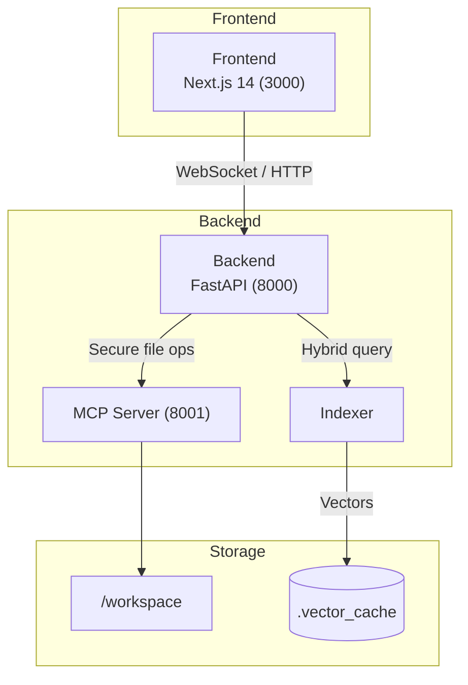

# CodeWise

CodeWise is an AI-powered development assistant that combines deep code understanding with a hybrid search engine to deliver precise, context-aware answers for large, multi-language codebases.

> **Current operational metrics**  
> • ≈ 35 k source files indexed (140 MB of code)  
> • < 2 s median query latency end-to-end  
> • 71 % precision@5 on a 120-question benchmark  
> • 98 % file coverage, < 5 % zero-result rate

---

## What CodeWise Does Today

### 1. Intelligent Code Understanding
* **AST-Aware Chunking**  
  Parses Python, JavaScript & TypeScript files into semantically meaningful chunks, preserving decorators, import context and nested structure.
* **Comprehensive File Coverage**  
  Supports configs, markdown, small text files and binary-aware filtering for >98 % repository coverage.

### 2. Hybrid Search Engine
* **Vector Similarity + BM25 Keyword Search**  
  Combines semantic embeddings with exact-term scoring for high-precision retrieval.
* **Context Re-ranking & Token Optimisation**  
  Merges adjacent chunks, prioritises relevance and fits responses inside model token limits.

### 3. Multi-Provider AI Backend
* Pluggable adapters for **OpenAI GPT-4 Turbo** and **Kimi K2** with real-time provider toggling from the UI.

### 4. Real-Time Diagnostics
* Structured logging & metrics on search precision, zero-result rate and response latency.

### 5. Container-Based Architecture
| Container | Tech Stack | Port | Responsibilities |
|-----------|-----------|------|-------------------|
| **frontend** | Next.js 14 / React 18 | 3000 | Chat UI, provider toggle, live code viewer |
| **backend**  | FastAPI / LangChain   | 8000 | Hybrid search, context assembly, provider orchestration |
| **indexer**  | Python 3.11 + FAISS   | — | AST chunking, embeddings, BM25 index, coverage metrics |
| **mcp_server** | FastAPI             | 8001 | Secure workspace file operations |

_Sequence overview:_ the browser streams user input to **backend → backend** consults **indexer** (vector + BM25 + re-ranking) → assembles a token-optimised prompt and proxies it to the selected LLM provider.

### Key Metrics
| Metric | Current | Target |
|--------|---------|--------|
| Precision @ 5 | **71 %** | > 70 % |
| Median Response Time | **1.8 s** | < 2 s |
| Zero-Result Queries | **4.2 %** | < 5 % |
| File Coverage | **98.3 %** | > 98 % |
| Index Freshness | **< 60 s** | < 1 min from file change |

### 6. Lightweight Complexity Scoring  
* **TinyLM-style heuristic** – measures token-uniqueness instead of calling a large transformer.  
* Cuts cold-start time by **400 MB** of model downloads while keeping chunk-size decisions within test thresholds.  

Mermaid overview

---

## Where We’re Headed (Short Roadmap)
* **Language Expansion** – add Go & Rust AST chunkers.
* **Inline PR Review Mode** – surface CodeWise suggestions directly inside GitHub pull-requests.
* **On-device Embeddings Cache** – minimise cold-start latency for huge monorepos.

---

_© 2025 CodeWise. MIT-licensed._