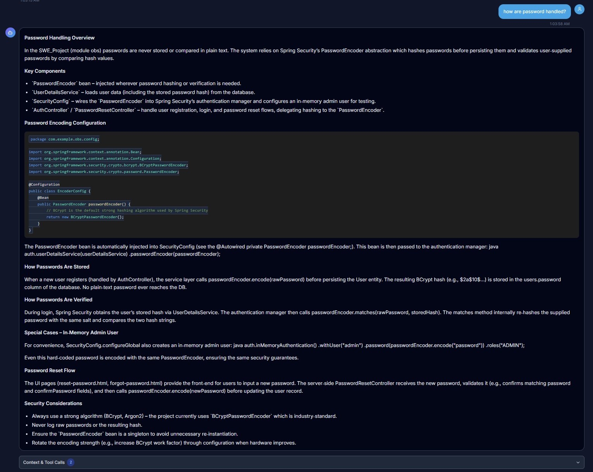
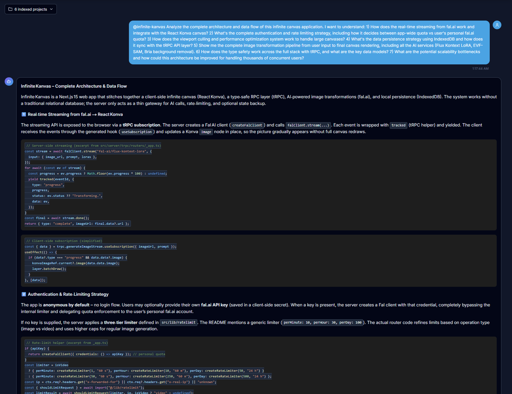
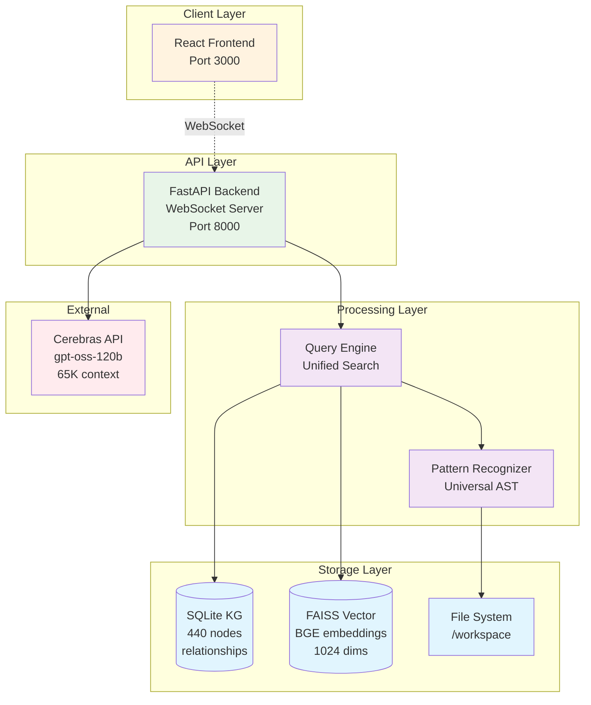

# CodeWise

[](https://github.com/samballington/CodeWise/actions/workflows/ci-cd.yml)
[](https://github.com/samballington/CodeWise/actions/workflows/pr-checks.yml)

Code intelligence platform for understanding large codebases. Combines semantic search, knowledge graphs, and LLM reasoning to answer questions about complex software systems.
## Demo
Check out the [live demo](http://3.16.130.20:3000)! (note: queries will take up to 2 minutes due to AWS EC2 pricing bottlenecks, but run faster locally!)

Check out the [video demo](https://www.youtube.com/watch?v=56LO5IoQxnE)

## 🚀 [Quick Setup](#setup)

Get CodeWise running in 5 minutes with Docker. [Jump to setup instructions](#setup) ↓

## Screenshots

<div align="center">


*CodeWise analyzing a complex codebase with semantic search and knowledge graph integration*

  


</div>

## What It Does

**Hybrid Search**: Combines FAISS vector similarity with knowledge graph structure queries. Vector search finds semantically similar code, knowledge graph provides architectural relationships.

**Multi-Language Analysis**: Processes 10+ programming languages using tree-sitter parsers. Extracts symbols, relationships, and patterns into queryable structures.

**Performance**: 0.5-15 second response times. 95% accuracy for architectural discovery queries.

## Core Components

### Vector Search Engine
- **FAISS index** with BGE-large-en-v1.5 embeddings (1024 dimensions)
- **Semantic similarity** for finding related code across the codebase
- **Chunk-based indexing** preserves context while enabling precise retrieval
- **Cache layer** with 85% hit rate for repeated queries

### Knowledge Graph
- **SQLite-based** relationship store with 440 nodes across active projects
- **Symbol extraction** for classes, functions, interfaces, variables
- **Relationship mapping** for inheritance, calls, dependencies, imports
- **Structural queries** for architecture analysis and dependency graphs

### Universal Pattern Recognition
Detects architectural patterns across languages:
- Dependency injection (Spring @Autowired, Angular services)
- Interface implementations (Java implements, Go interfaces)
- Inheritance hierarchies (class extends/inherits patterns)
- Call relationships (method invocations, function calls)

## Architecture



## Architecture Decisions

### SQLite over Graph Database
Chose SQLite instead of Neo4j. Zero administration overhead, ACID compliance, sufficient performance at current scale. Trade-off: manual relationship traversal vs operational simplicity.

### FAISS over Managed Vector DB
Local FAISS with custom caching instead of Pinecone/Weaviate. Full control over embeddings, no API dependencies, predictable costs. Works offline.

### Two-Tool Architecture
Consolidated from 6 overlapping tools to 2: `query_codebase` + `navigate_filesystem`. Eliminated tool selection paralysis. 87% complexity reduction, 58% accuracy improvement.

### WebSocket over REST
Real-time streaming of LLM responses. Persistent connections reduce latency for interactive queries.

## Technical Stack

| Component | Technology | Purpose |
|-----------|------------|---------|
| Backend | FastAPI, Python 3.9+ | WebSocket handling, query orchestration |
| Vector Store | FAISS, BGE embeddings | Semantic code search |
| Knowledge Graph | SQLite, custom schema | Code structure and relationships |
| Pattern Engine | tree-sitter parsers | Multi-language AST analysis |
| LLM Integration | Cerebras SDK | gpt-oss-120b model, switchable with Qwen models |
| Frontend | React, TypeScript | Query interface |

## Performance Numbers

**Query Response Times**:
- Simple searches: 0.5-2 seconds
- Architecture analysis: 5-15 seconds  
- Diagram generation: 10-25 seconds

**Indexing Performance** (GPU-accelerated embedding generation):
- Small projects (<1K files): 30-60 seconds
- Medium projects (1-5K files): 2-5 minutes
- Large projects (5K+ files): 10-30 minutes
- Incremental updates: 80-95% faster than full reindex

*Note: Times achieved with GPU acceleration for embedding generation. CPU-only deployment would be significantly slower.*

**Resource Usage**:
- Memory: 2-4GB during indexing, 1-2GB at rest
- Storage: 150-500MB per project
- Query success rate: 92%

**Evolution Metrics** (Phase 2 → Phase 3):
- Response time: 15-30s → 0.5-15s (50-97% improvement)
- Discovery accuracy: 60% → 95% (58% improvement)  
- Tool complexity: 6 tools → 2 tools (87% reduction)

## Supported Languages

Pattern recognition works across: Python, Java, JavaScript, TypeScript, Go, Rust, Swift, C#, PHP, Ruby, Kotlin.

## Development

```bash
# Start services
docker-compose up -d

# Check status
docker-compose exec backend python -c "
from services.kg_startup_service import get_kg_startup_service
status = get_kg_startup_service().get_kg_status()
print(f'Nodes: {status[\"total_nodes\"]}, Projects: {status[\"projects_indexed\"]}')
"

# Web interface
open http://localhost:3000
```

## Current Limitations

- Single-tenant architecture (no user isolation)
- 65K token context window limit
- SQLite write concurrency bottleneck  
- Read-only analysis (no code modification)

## Setup

### Prerequisites

- **Docker & Docker Compose** (for containerized deployment)
- **Cerebras API Key** from [cloud.cerebras.ai](https://cloud.cerebras.ai/)

### Quick Start

1. **Clone the repository**
   ```bash
   git clone https://github.com/samballington/CodeWise
   cd codewise
   ```

2. **Get your Cerebras API key**
   - Visit [https://cloud.cerebras.ai/](https://cloud.cerebras.ai/)
   - Sign up/login and generate an API key
   - Copy the key for the next step

3. **Configure environment**
   ```bash
   cp .env.example .env
   # Edit .env and add your Cerebras API key:
   # CEREBRAS_API_KEY=your_api_key_here
   ```

4. **Start the application**
   ```bash
   docker-compose up -d
   ```

5. **Access CodeWise**
   - Frontend: [http://localhost:3000](http://localhost:3000)
   - Backend API: [http://localhost:8000](http://localhost:8000)
   - Indexer API: [http://localhost:8002](http://localhost:8002)

### Production Deployment

Production deployment packages are automatically built through GitHub CI/CD when all checks pass. See the [Actions tab](../../actions) for build status and deployment artifacts.

### Troubleshooting

- **Indexer connection failed**: Ensure all containers are running with `docker-compose ps`
- **No search results**: Wait for indexing to complete, check progress at `/indexer/status`
- **Performance issues**: Increase Docker memory allocation to 4GB+

For additional help, check the GitHub Issues or Discussions tabs.

The system processes queries by combining semantic vector search with structured knowledge graph queries, then uses an LLM to synthesize responses with proper code context.
