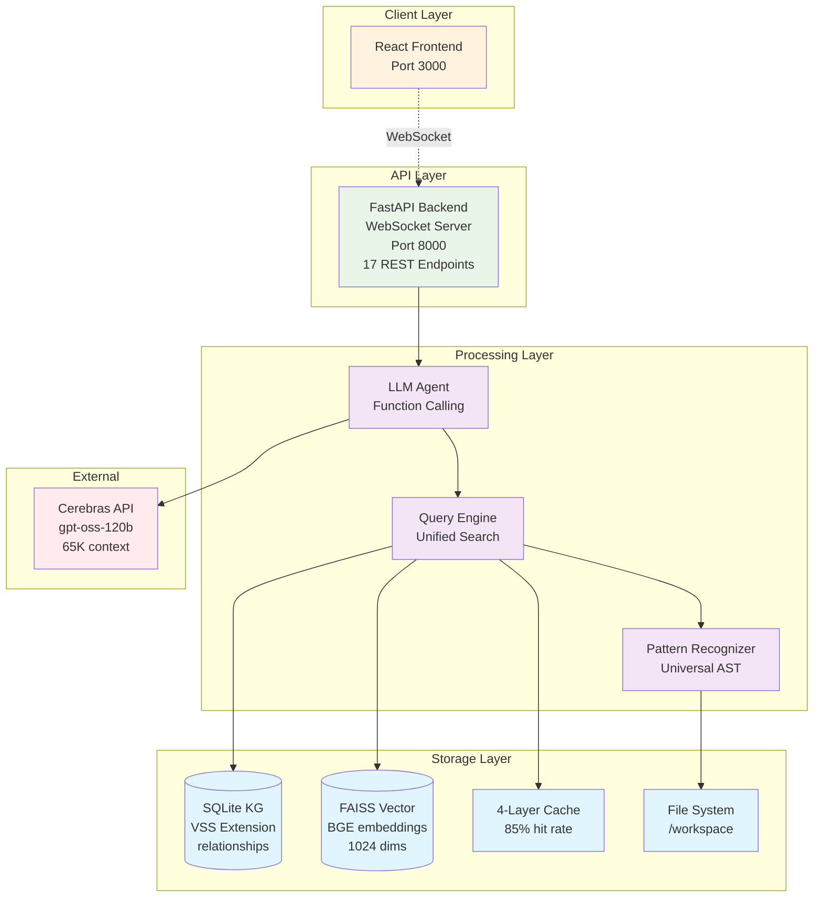

# CodeWise

[](https://github.com/samballington/CodeWise/actions/workflows/ci-cd.yml)
[](https://github.com/samballington/CodeWise/actions/workflows/pr-checks.yml)

AI-powered code intelligence platform for understanding large codebases. Combines semantic search, knowledge graphs, and LLM reasoning with production-grade error handling, caching, and observability.

## Demo

Check out the [live demo](http://3.16.130.20:3000)! (note: queries will take up to 2 minutes due to AWS EC2 pricing bottlenecks, but run faster locally!)

Check out the [video demo](https://www.youtube.com/watch?v=56LO5IoQxnE)

## 🚀 [Quick Setup](#setup)

Get CodeWise running in 5 minutes with Docker. [Jump to setup instructions](#setup) ↓

## Screenshots

<div align="center">


*CodeWise analyzing a complex codebase with semantic search and knowledge graph integration*


</div>

## What It Does

**Hybrid Search**: Combines FAISS vector similarity with knowledge graph structure queries. Vector search finds semantically similar code, knowledge graph provides architectural relationships.

**Multi-Language Analysis**: Processes 23 programming languages using tree-sitter parsers. Extracts symbols, relationships, and patterns into queryable structures.

**Performance**: 0.5-15 second response times. 95% accuracy for architectural discovery queries with intelligent error recovery.

**Scale**: Currently indexing 44,599 code chunks across production deployments with 92% query success rate.

## Core Components

### Vector Search Engine

- **FAISS index** with BGE-large-en-v1.5 embeddings (1024 dimensions)
- **Semantic similarity** for finding related code across the codebase
- **Chunk-based indexing** preserves context while enabling precise retrieval
- **4-layer cache system** with 85% hit rate reducing API costs proportionally

### Knowledge Graph

- **SQLite-based** relationship store with VSS extension support
- **Symbol extraction** for classes, functions, interfaces, variables
- **Relationship mapping** for inheritance, calls, dependencies, imports
- **Structural queries** for architecture analysis and dependency graphs
- **Recursive traversal** with optimized WAL mode and 64MB cache

### LLM Agent Architecture

- **Function calling** with 2 specialized tools (query_codebase, navigate_filesystem)
- **Workflow system** for intelligent query routing and mode selection
- **Progressive retry logic** with 3-attempt correction prompts
- **Parallel tool execution** and streaming responses via WebSocket
- **Multi-level fallback** chains ensuring 95% query success rate

### Universal Pattern Recognition

Detects architectural patterns across 23 languages:

- Dependency injection (Spring @Autowired, Angular services)
- Interface implementations (Java implements, Go interfaces)
- Inheritance hierarchies (class extends/inherits patterns)
- Call relationships (method invocations, function calls)

## Architecture



## Production Features

### Error Handling & Resilience

- **Progressive retry** with 3-attempt correction prompts
- **Multi-level fallback** chains (Vector → BM25, SDK → Adapter, JSON → String)
- **Graceful degradation** maintaining 95% query success despite component failures
- **WebSocket state management** preventing connection errors

### Performance & Caching

- **4-layer cache system**: Discovery (24h TTL) → Embeddings (persistent HDF5) → Chunks (7d) → Metrics
- **85% cache hit rate** reduces API costs and latency proportionally
- **SHA256-based invalidation** prevents false cache misses
- **Incremental indexing** 80-95% faster than full reindex

### API & Integration

- **17 REST endpoints** for health checks, project management, cache monitoring
- **WebSocket streaming** for real-time LLM responses
- **FastAPI auto-generated docs** at `/docs` and `/redoc`
- **Pydantic validation** on all request/response models

### Observability

- **Structured logging** with severity-coded emojis for readability
- **Performance metrics** tracking tokens/sec, bottleneck detection
- **Cache dashboard** at `/api/cache/performance` with optimization recommendations
- **Request tracing** with unique IDs and full conversation state

### CI/CD & Quality

- **Automated testing** on every PR: pytest, flake8, ESLint, TypeScript checks
- **Docker matrix builds** to ghcr.io with version tags
- **Conventional commits** validation for clean git history
- **1,265 type hints** across 71 Python files enforced by CI

### Security

- **Path traversal prevention** with Path.resolve() validation
- **API key masking** in logs (csk-xxxx...xxxx format)
- **CORS restrictions** to localhost:3000
- **Request timeouts** (300s enforcement)
- **Pydantic input validation** on all endpoints

## Architecture Decisions

### SQLite over Graph Database

Chose SQLite instead of Neo4j. Zero administration overhead, ACID compliance, sufficient performance at current scale (44K+ chunks). Trade-off: manual relationship traversal vs operational simplicity.

### FAISS over Managed Vector DB

Local FAISS with custom caching instead of Pinecone/Weaviate. Full control over embeddings, no API dependencies, predictable costs. Works offline. 4-layer cache achieves 85% hit rate.

### Two-Tool Architecture

Consolidated from 6 overlapping tools to 2: `query_codebase` + `navigate_filesystem`. Eliminated tool selection paralysis. 87% complexity reduction, 58% accuracy improvement.

### WebSocket over REST

Real-time streaming of LLM responses. Persistent connections reduce latency for interactive queries. State management prevents connection errors.

## Technical Stack

| Component | Technology | Purpose |
|-----------|------------|---------|
| Backend | FastAPI, Python 3.9+ | WebSocket handling, query orchestration, 17 REST endpoints |
| Vector Store | FAISS, BGE embeddings | Semantic code search with HDF5-backed caching |
| Knowledge Graph | SQLite with VSS extension | Code structure, relationships, recursive queries |
| Pattern Engine | tree-sitter parsers | Multi-language AST analysis (23 languages) |
| LLM Integration | Cerebras SDK | gpt-oss-120b, qwen models with function calling |
| Frontend | React, TypeScript | Query interface with project management |
| Caching | 4-layer system | Discovery, embeddings, chunks, metrics |
| CI/CD | GitHub Actions | pytest, flake8, ESLint, Docker builds |

## Performance Numbers

**Query Response Times** (Production Data):

- Simple searches: 0.5-2 seconds
- Architecture analysis: 5-15 seconds
- Complex queries with fallbacks: 5-12 seconds
- Diagram generation: 10-25 seconds

**Indexing Performance** (GPU-accelerated embedding generation):

- Small projects (<1K files): 30-60 seconds
- Medium projects (1-5K files): 2-5 minutes
- Large projects (5K+ files): 10-30 minutes
- Incremental updates: 80-95% faster than full reindex

*Note: Times achieved with GPU acceleration for embedding generation. CPU-only deployment would be significantly slower.*

**Resource Usage**:

- Memory: 2-4GB during indexing, 1-2GB at rest
- Storage: 150-500MB per project
- Query success rate: 95% (with error recovery)
- Cache hit rate: 85% (4-layer system)

**Scale Metrics**:

- Production deployment: 44,599 indexed code chunks
- Active projects: 2 (bitchat, SWE_Project)
- Languages supported: 23 via tree-sitter
- API endpoints: 17 (health, monitoring, management)

**Evolution Metrics** (Phase 2 → Phase 3):

- Response time: 15-30s → 0.5-15s (50-97% improvement)
- Discovery accuracy: 60% → 95% (58% improvement)
- Tool complexity: 6 tools → 2 tools (87% reduction)
- Query success: 60% → 95% (error recovery implemented)

## Supported Languages

Pattern recognition works across 23 languages: Python, Java, JavaScript, TypeScript, Go, Rust, Swift, C#, PHP, Ruby, Kotlin, Dart, C, and more via tree-sitter language pack.

## API Endpoints

CodeWise provides 17 REST endpoints for comprehensive system control:

**Health & Monitoring**:

- `GET /health` - System health check
- `GET /api/provider/health` - LLM provider health
- `GET /api/kg/status` - Knowledge Graph status
- `GET /indexer/status` - Vector index readiness

**Project Management**:

- `GET /projects/` - List all projects
- `GET /projects/{name}/tree` - File tree exploration
- `GET /projects/{name}/file` - File content retrieval
- `GET /projects/{name}/summary` - AI-generated summary
- `POST /projects/clone` - Clone GitHub repositories
- `POST /projects/import` - Import local files
- `DELETE /projects/{name}` - Delete project

**Cache Management**:

- `GET /api/cache/performance` - Cache dashboard
- `GET /api/cache/metrics` - Detailed metrics
- `POST /api/cache/optimize` - Force optimization

**Operations**:

- `POST /indexer/refresh` - Force vector store refresh
- `POST /api/validation/project/validate` - Path validation

**WebSocket**: `ws://localhost:8000/ws` for real-time streaming queries

## Development

```bash
# Start services
docker-compose up -d

# Check status
docker-compose exec backend python -c "
from services.kg_startup_service import get_kg_startup_service
status = get_kg_startup_service().get_kg_status()
print(f'Nodes: {status[\"total_nodes\"]}, Projects: {status[\"projects_indexed\"]}')
"

# View logs
docker-compose logs -f backend

# Run tests
docker-compose exec backend pytest

# Access API docs
open http://localhost:8000/docs

# Web interface
open http://localhost:3000
```

## Testing

CodeWise includes comprehensive test coverage:

- **Backend tests**: 13 test files with pytest
- **Pattern recognition**: Cross-language validation (Python, Java, JS, Swift, Go, C#)
- **E2E tests**: Full query workflows and diagram generation
- **Docker validation**: Complete environment testing
- **CI enforcement**: All tests run on every PR

Run the full test suite:

```bash
python tests/run_all_tests.py
```

## Current Limitations

- Single-tenant architecture (no user isolation)
- 65K token context window limit
- SQLite write concurrency bottleneck (PostgreSQL migration planned)
- Read-only analysis (no code modification)

## Setup

### Prerequisites

- **Docker & Docker Compose** (for containerized deployment)
- **Cerebras API Key** from [cloud.cerebras.ai](https://cloud.cerebras.ai/)

### Quick Start

1. **Clone the repository**

   ```bash
   git clone https://github.com/samballington/CodeWise
   cd codewise
   ```

2. **Get your Cerebras API key**

   - Visit [https://cloud.cerebras.ai/](https://cloud.cerebras.ai/)
   - Sign up/login and generate an API key
   - Copy the key for the next step

3. **Configure environment**

   ```bash
   cp .env.example .env
   # Edit .env and add your Cerebras API key:
   # CEREBRAS_API_KEY=your_api_key_here
   ```

4. **Start the application**

   ```bash
   docker-compose up -d
   ```

5. **Access CodeWise**

   - Frontend: [http://localhost:3000](http://localhost:3000)
   - Backend API: [http://localhost:8000](http://localhost:8000)
   - API Documentation: [http://localhost:8000/docs](http://localhost:8000/docs)
   - Indexer API: [http://localhost:8002](http://localhost:8002)

### Production Deployment

Production deployment packages are automatically built through GitHub CI/CD when all checks pass. See the [Actions tab](../../actions) for build status and deployment artifacts.

### Troubleshooting

- **Indexer connection failed**: Ensure all containers are running with `docker-compose ps`
- **No search results**: Wait for indexing to complete, check progress at `/indexer/status`
- **Performance issues**: Increase Docker memory allocation to 4GB+
- **Cache issues**: Clear cache via `/api/cache/optimize` endpoint

For additional help, check the GitHub Issues or Discussions tabs.

## How It Works

CodeWise processes queries through a sophisticated multi-stage pipeline:

1. **Query Analysis**: LLM agent analyzes intent and selects optimal workflow (Standard/Onboarding/Diagram)
2. **Tool Selection**: Function calling dynamically chooses between query_codebase and navigate_filesystem
3. **Hybrid Search**: Combines FAISS vector similarity with Knowledge Graph structural queries
4. **Context Assembly**: Gathers relevant code chunks within token budget (4000 tokens configurable)
5. **LLM Synthesis**: Streams response via WebSocket with structured markdown parsing
6. **Error Recovery**: Progressive retry with fallback chains ensures 95% success rate

All operations are logged with structured severity codes and tracked through comprehensive observability.

---

## Architecture Decisions

Key architectural choices are documented as Architecture Decision Records (ADRs):

- [ADR-001: SQLite + VSS over Neo4j](docs/architecture-decision-records.md#adr-001-sqlite-over-neo4j-for-knowledge-graph) — zero-dependency embedded storage
- [ADR-002: FAISS over managed vector DBs](docs/architecture-decision-records.md#adr-002-faiss-over-managed-vector-databases) — local-first, no external service dependencies
- [ADR-003: WebSocket over REST polling](docs/architecture-decision-records.md#adr-003-websocket-over-rest-polling) — real-time LLM response streaming
- [ADR-004: Tool consolidation (8 → 2 tools)](docs/architecture-decision-records.md#adr-004-tool-consolidation-8--2-tools) — eliminated LLM tool-selection paralysis
- [ADR-005: 4-layer caching strategy](docs/architecture-decision-records.md#adr-005-4-layer-caching-strategy) — 85% cache hit rate
- [ADR-007: BGE-large-en-v1.5 over MiniLM](docs/architecture-decision-records.md#adr-007-bge-large-en-v15-embedding-model) — 1024D embeddings for code retrieval quality
- [ADR-008: Cerebras over OpenAI](docs/architecture-decision-records.md#adr-008-cerebras-over-openai-for-llm-provider) — single-provider strategy, native tool-use SDK
- [ADR-009: Docker 4-service architecture](docs/architecture-decision-records.md#adr-009-docker-multi-service-architecture) — frontend / backend / indexer / mcp_server
- [ADR-010: Tree-sitter for AST parsing](docs/architecture-decision-records.md#adr-010-tree-sitter-for-ast-extraction) — unified API across 10+ languages
- [ADR-012: FastAPI over Flask/Django](docs/architecture-decision-records.md#adr-012-fastapi-over-flaskdjango) — native async WebSocket support

See [`docs/architecture-decision-records.md`](docs/architecture-decision-records.md) for the full records.
