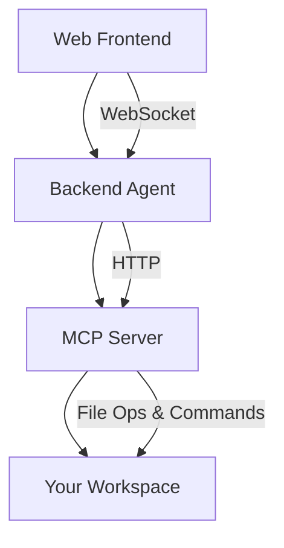

# CodeWise - AI Development Assistant

CodeWise is an agentic AI-powered development assistant that streamlines the software development lifecycle. It understands complex requests in natural language, plans multi-step tasks, and executes them through secure file operations and command execution.

## What It Does

- **Intelligent Code Assistant**: Reads, writes, and analyzes code files
- **Task Automation**: Runs tests, installs packages, and executes development commands  
- **Agentic Planning**: Breaks down high-level goals into concrete, executable steps
- **Real-time Interaction**: Provides live feedback through a modern web interface

## Purpose

CodeWise bridges the gap between natural language instructions and actual code execution. Instead of manually performing repetitive development tasks, you can describe what you want to accomplish and let the AI agent handle the implementation details.

**Example requests:**
- "Create a REST API for user authentication"
- "Add unit tests to the payment module" 
- "Refactor this code to use dependency injection"
- "Set up a CI/CD pipeline configuration"

## Architecture

### Components

- **Frontend** (Next.js): Interactive chat interface for natural language interaction
- **Backend** (FastAPI + LangChain): AI agent that processes requests and coordinates actions
- **MCP Server** (FastAPI): Secure execution layer for file operations and system commands
- **Workspace**: Isolated directory where your project files live

## Quick Start

1. **Prerequisites**: Docker, Docker Compose, OpenAI API key
2. **Setup**: Copy `env.example` to `.env` and add your OpenAI API key
3. **Run**: Execute `./start.sh` (Linux/Mac) or `.\start.ps1` (Windows)
4. **Access**: Open http://localhost:3000 and start chatting with your AI assistant

## Security

- All operations are sandboxed within the workspace directory
- Command execution has timeout protection
- API keys are never exposed to the frontend
- Docker container isolation provides additional security layers

---

**License**: MIT | **Requirements**: Docker, OpenAI API Key 